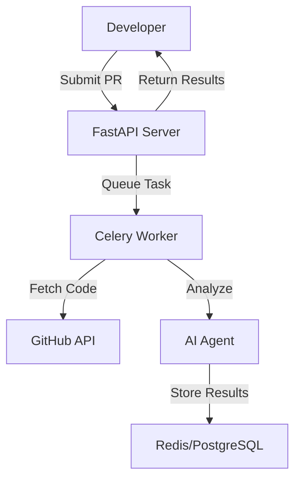

# Code Review Agent System Architecture

## System Overview



## Detailed Component Flow

### 1. API Layer
```
Developer Request
    |
    v
┌─────────────────┐
│   FastAPI App   │
│                 │
│ POST /analyze-pr│
│ GET /status/    │
│ GET /results/   │
└─────────────────┘
    |
    v
Task Queue
```

### 2. Processing Pipeline
```
┌─────────────────┐    ┌─────────────────┐    ┌─────────────────┐
│   Celery        │    │   GitHub        │    │   AI Agent      │
│   Worker        │    │   Service       │    │   Framework     │
│                 │    │                 │    │                 │
│ • Task Queue    │--->│ • Fetch PR      │--->│ • Code Analysis │
│ • Status Track  │    │ • Get Diff      │    │ • Style Check   │
│ • Error Handle  │    │ • Get Files     │    │ • Bug Detection │
└─────────────────┘    └─────────────────┘    └─────────────────┘
    |                                              |
    v                                              v
┌─────────────────┐    ┌─────────────────┐    ┌─────────────────┐
│   Redis Cache   │    │   PostgreSQL    │    │   Results       │
│                 │    │   Database      │    │   Storage       │
│ • Task Status   │    │ • Analysis      │    │ • File Issues   │
│ • API Results   │    │ • Results       │    │ • Suggestions   │
│ • Vector Cache  │    │ • Metadata      │    │ • Performance   │
└─────────────────┘    └─────────────────┘    └─────────────────┘
```

### 3. Data Flow Sequence
```
1. Developer submits PR
   |
   v
2. FastAPI creates task
   |
   v
3. Celery worker picks up task
   |
   v
4. GitHub service fetches code
   |
   v
5. AI agent analyzes code
   |
   v
6. Results stored in database
   |
   v
7. Developer retrieves results
```

## Component Interactions

### API Endpoints
```
┌─────────────────────────────────────────────────────────────┐
│                    API Endpoints                            │
├─────────────────────────────────────────────────────────────┤
│ POST /analyze-pr                                            │
│ ├── Input: repo_url, pr_number, github_token               │
│ ├── Output: task_id                                        │
│ └── Action: Queue analysis task                            │
├─────────────────────────────────────────────────────────────┤
│ GET /status/{task_id}                                      │
│ ├── Input: task_id                                         │
│ ├── Output: status (pending/processing/completed/failed)   │
│ └── Action: Check task progress                            │
├─────────────────────────────────────────────────────────────┤
│ GET /results/{task_id}                                     │
│ ├── Input: task_id                                         │
│ ├── Output: analysis results                               │
│ └── Action: Retrieve completed analysis                    │
└─────────────────────────────────────────────────────────────┘
```

### AI Agent Analysis Types
```
┌─────────────────────────────────────────────────────────────┐
│                    AI Agent Analysis                        │
├─────────────────────────────────────────────────────────────┤
│ 🔍 Code Style & Formatting                                 │
│ ├── Line length violations                                 │
│ ├── Naming conventions                                     │
│ ├── Import organization                                    │
│ └── Code formatting issues                                 │
├─────────────────────────────────────────────────────────────┤
│ 🐛 Potential Bugs & Errors                                 │
│ ├── Null pointer exceptions                                │
│ ├── Type mismatches                                        │
│ ├── Logic errors                                           │
│ └── Edge case handling                                     │
├─────────────────────────────────────────────────────────────┤
│ ⚡ Performance Improvements                                 │
│ ├── Algorithm optimization                                 │
│ ├── Memory usage                                           │
│ ├── Database queries                                       │
│ └── Resource management                                    │
├─────────────────────────────────────────────────────────────┤
│ 📚 Best Practices                                          │
│ ├── Security vulnerabilities                               │
│ ├── Design patterns                                        │
│ ├── Documentation quality                                  │
│ └── Testing coverage                                       │
└─────────────────────────────────────────────────────────────┘
```

## Deployment Architecture

### Docker Setup
```
┌─────────────────┐    ┌─────────────────┐    ┌─────────────────┐
│   FastAPI       │    │   Celery        │    │   PostgreSQL    │
│   Container     │    │   Worker        │    │   Container     │
│                 │    │   Container     │    │                 │
│ • API Server    │    │ • Task          │    │ • Database      │
│ • Health Check  │    │   Processing    │    │ • Migrations    │
│ • Documentation │    │ • Agent         │    │ • Backup        │
└─────────────────┘    └─────────────────┘    └─────────────────┘
         |                       |                       |
         v                       v                       v
┌─────────────────────────────────────────────────────────────┐
│                    Redis Container                          │
│                                                             │
│ • Task Queue                                                │
│ • Result Cache                                              │
│ • Session Storage                                           │
└─────────────────────────────────────────────────────────────┘
```

### Scaling Strategy
```
┌─────────────────┐    ┌─────────────────┐    ┌─────────────────┐
│   Load          │    │   Multiple      │    │   Database      │
│   Balancer      │    │   API Instances │    │   Replicas      │
│                 │    │                 │    │                 │
│ • Traffic       │    │ • FastAPI       │    │ • Read          │
│   Distribution  │    │   Servers       │    │   Replicas      │
│ • Health        │    │ • Auto-scaling  │    │ • Write         │
│   Monitoring    │    │ • Load          │    │   Primary       │
└─────────────────┘    └─────────────────┘    └─────────────────┘
         |                       |                       |
         v                       v                       v
┌─────────────────┐    ┌─────────────────┐    ┌─────────────────┐
│   Multiple      │    │   Redis         │    │   Monitoring    │
│   Celery        │    │   Cluster       │    │   Stack         │
│   Workers       │    │                 │    │                 │
│                 │    │ • High          │    │ • Prometheus    │
│ • Parallel      │    │   Availability  │    │ • Grafana       │
│   Processing    │    │ • Data          │    │ • Logging       │
│ • Priority      │    │   Persistence   │    │ • Alerting      │
│   Queues        │    │ • Failover      │    │ • Metrics       │
└─────────────────┘    └─────────────────┘    └─────────────────┘
```

## Performance Metrics

### Optimization Features
```
┌─────────────────────────────────────────────────────────────┐
│                    Performance Metrics                      │
├─────────────────────────────────────────────────────────────┤
│ ⚡ Processing Time: 2-5 minutes per PR (10-20 files)        │
│ 🎯 Cache Hit Rate: 60-80% for similar codebases            │
│ 💰 Cost Reduction: Up to 70% savings on LLM API costs      │
│ 🔄 Concurrency: Supports 10+ concurrent PR analyses        │
│ 📊 Vector Caching: ~60-70% reduction in LLM API calls      │
│ ⚙️ Parallel Processing: Multiple agents run concurrently    │
│ 🧠 Chunk-level Caching: Function and class level caching   │
│ 🎯 Smart Filtering: Only analyze relevant file types       │
└─────────────────────────────────────────────────────────────┘
```

---

*This diagram shows the complete architecture of the autonomous code review agent system, including API endpoints, processing pipeline, component interactions, deployment setup, and performance metrics.*