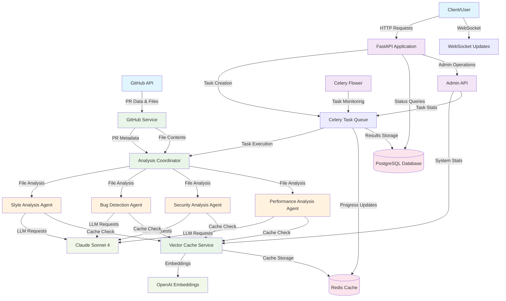
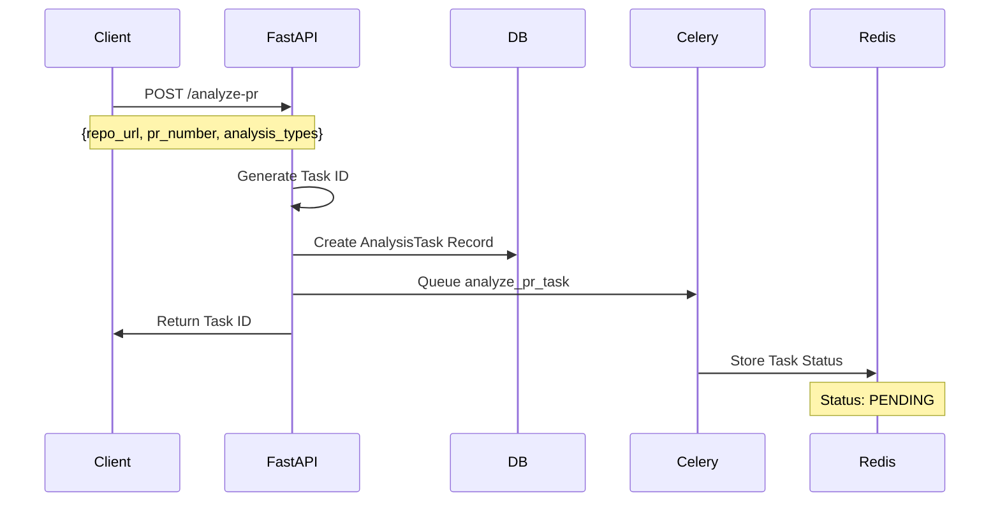
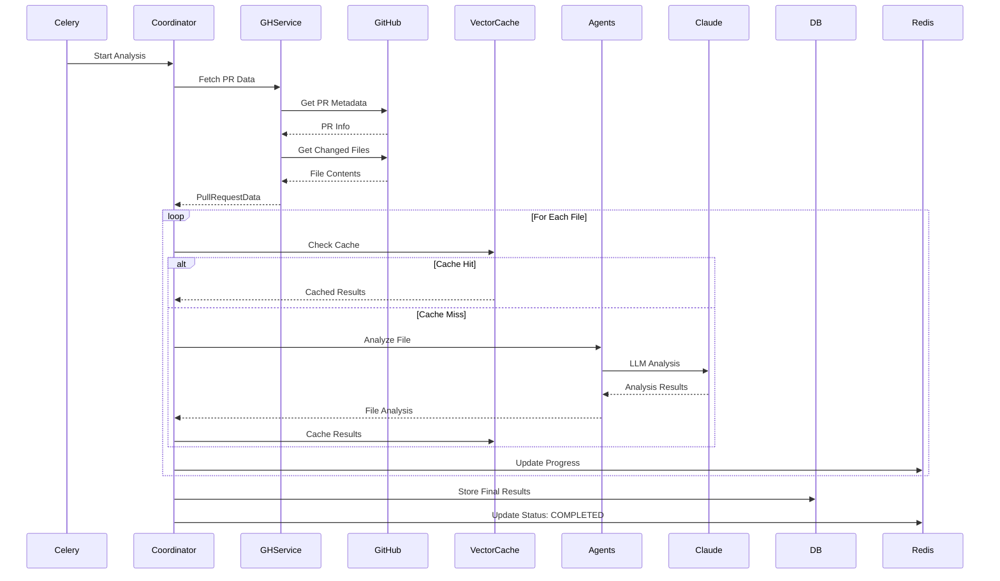
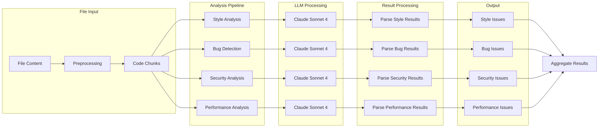
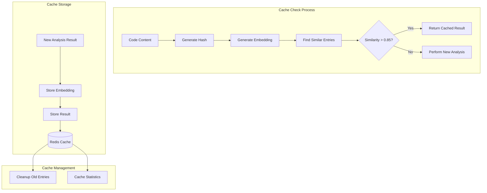
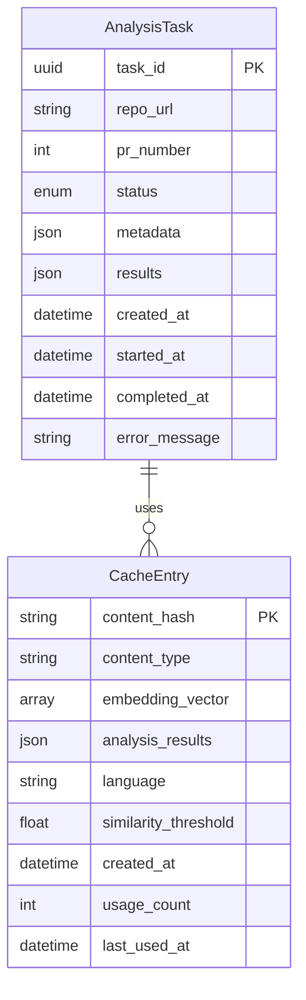
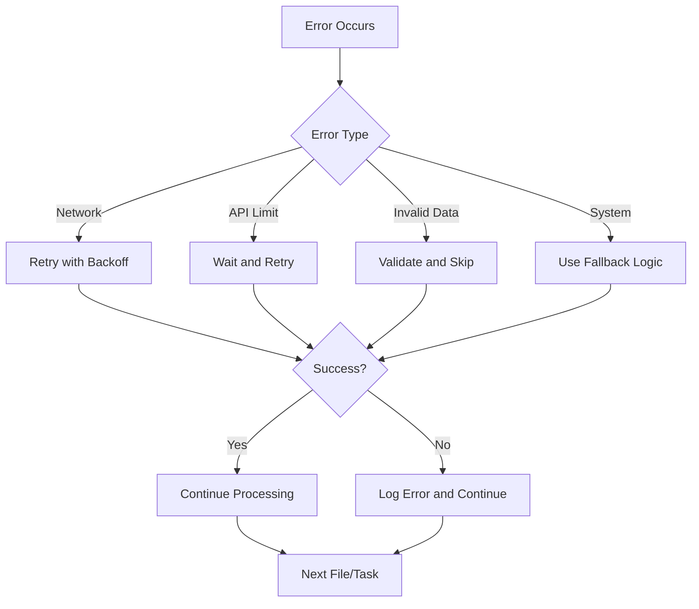

# GitHub PR Analyzer - Complete Dataflow Diagram

## System Architecture Overview

## Detailed Data Flow

### 1. Request Initiation Flow

### 2. Task Processing Flow

### 3. Agent Analysis Flow

### 4. Vector Cache Flow

### 5. Database Schema Flow

## Component Interactions

### FastAPI Application (`app/main.py`)
- **Input**: HTTP requests for PR analysis
- **Output**: Task IDs and status responses
- **Key Functions**:
  - `POST /analyze-pr`: Creates analysis tasks
  - `GET /status/{task_id}`: Returns task progress
  - `GET /results/{task_id}`: Returns analysis results
  - `GET /health`: Health check endpoint

### Celery Task System (`app/celery_app.py`)
- **Input**: Task parameters from FastAPI
- **Output**: Analysis results stored in database
- **Key Functions**:
  - `analyze_pr_task`: Main analysis orchestration
  - Progress tracking and status updates
  - Error handling and retry logic

### Analysis Coordinator (`app/agents/coordinator.py`)
- **Input**: PR data and analysis types
- **Output**: Comprehensive analysis results
- **Key Functions**:
  - Orchestrates multiple analysis agents
  - Manages file-level analysis
  - Aggregates results from all agents
  - Handles progress callbacks

### GitHub Service (`app/services/github_service.py`)
- **Input**: Repository URL and PR number
- **Output**: PR metadata and file contents
- **Key Functions**:
  - Fetches PR data from GitHub API
  - Extracts changed files and their contents
  - Filters analyzable files
  - Handles authentication and rate limiting

### Vector Cache Service (`app/services/vector_cache.py`)
- **Input**: Code content and analysis type
- **Output**: Cached results or similarity matches
- **Key Functions**:
  - Generates embeddings using OpenAI
  - Finds similar cached analyses
  - Stores new analysis results
  - Manages cache lifecycle

### Analysis Agents
Each agent follows the same pattern:
- **Input**: File content and language
- **Output**: Structured analysis results
- **Key Functions**:
  - `StyleAnalysisAgent`: Code style and formatting
  - `BugDetectionAgent`: Logic errors and bugs
  - `SecurityAnalysisAgent`: Security vulnerabilities
  - `PerformanceAnalysisAgent`: Performance issues

## Data Storage Flow

### PostgreSQL Database
- **AnalysisTask**: Stores task metadata and results
- **Migrations**: Schema versioning with Alembic
- **Connection Pool**: Async database connections

### Redis Cache
- **Task Status**: Real-time task progress
- **Vector Cache**: Embeddings and analysis results
- **Celery Broker**: Task queue management
- **Session Storage**: Temporary data

## External API Dependencies

### GitHub API
- **Rate Limits**: 60 req/hour (public), 5000 req/hour (authenticated)
- **Endpoints Used**:
  - `/repos/{owner}/{repo}/pulls/{pr_number}`
  - `/repos/{owner}/{repo}/pulls/{pr_number}/files`
  - `/repos/{owner}/{repo}/contents/{path}`

### Anthropic Claude API
- **Model**: Claude Sonnet 4
- **Usage**: Code analysis and issue detection
- **Rate Limits**: Based on API tier

### OpenAI API
- **Model**: text-embedding-3-small
- **Usage**: Vector embeddings for caching
- **Rate Limits**: Based on API tier

## Error Handling and Resilience

## Performance Optimization Flow

### Caching Strategy
1. **Content Hash**: Generate SHA256 hash of code + analysis type
2. **Embedding Generation**: Create vector embedding for semantic similarity
3. **Similarity Search**: Find cached results above threshold (0.85)
4. **Cache Storage**: Store new results with metadata

### Parallel Processing
1. **File-Level Parallelism**: Analyze multiple files concurrently
2. **Agent-Level Parallelism**: Run different analysis types in parallel
3. **Chunk-Level Parallelism**: Process code chunks independently

### Resource Management
1. **Connection Pooling**: Reuse database and API connections
2. **Memory Management**: Stream large files and results
3. **Task Queuing**: Distribute load across multiple workers

## Monitoring and Observability

### Health Checks
- **API Health**: `/health` endpoint
- **Database Health**: Connection pool status
- **Redis Health**: Cache connectivity
- **External APIs**: GitHub, Claude, OpenAI availability

### Metrics Collection
- **Task Processing**: Success/failure rates, processing times
- **Cache Performance**: Hit rates, storage usage
- **API Usage**: Rate limit utilization, response times
- **System Resources**: CPU, memory, disk usage

### Logging Strategy
- **Structured Logging**: JSON format with correlation IDs
- **Log Levels**: DEBUG, INFO, WARNING, ERROR
- **Context Tracking**: Task ID, file name, analysis type
- **Error Reporting**: Detailed error context and stack traces