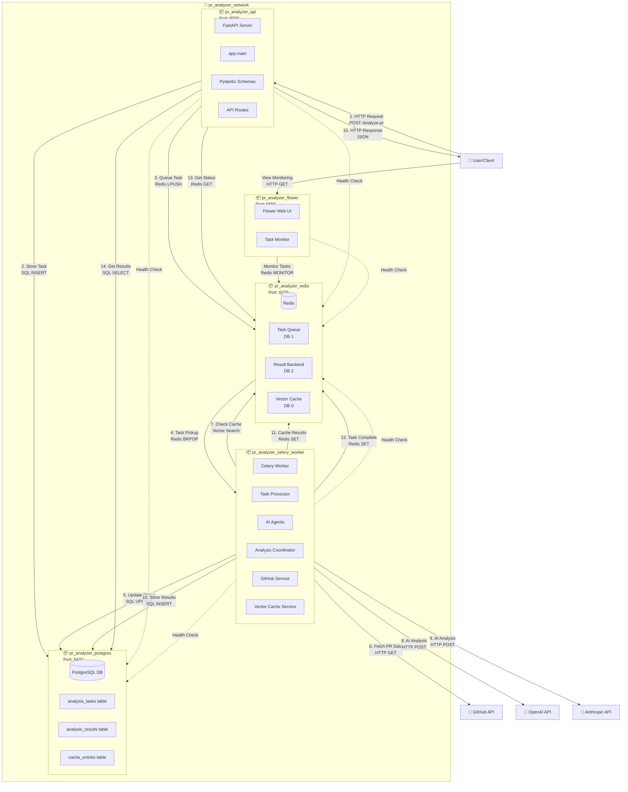
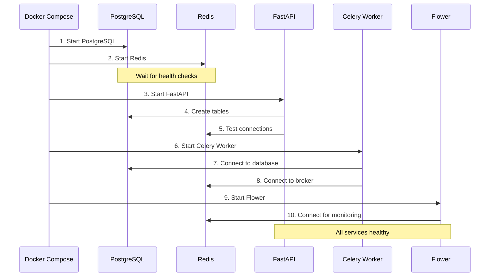

# Docker Container Data Flow Diagram

## GitHub PR Analyzer - Container Architecture & Data Flow

This diagram illustrates how data flows between Docker containers in the GitHub PR Analyzer system.



## Container-Specific Data Flow Details

### 1. API Container (`pr_analyzer_api`)
**Image**: `potpie-assignemnt-api`  
**Port**: `8000:8000`  
**Health**: `/health` endpoint

**Data Flow**:
```
Incoming:
├── HTTP Requests from Users (Port 8000)
├── Environment Variables (.env file)
└── Docker Volumes (shared code)

Outgoing:
├── Database Queries → PostgreSQL Container (Port 5432)
├── Redis Commands → Redis Container (Port 6379)
├── Task Queuing → Redis DB 1
├── Result Retrieval → Redis DB 2
└── HTTP Responses → Users
```

**Internal Data Processing**:
- Request validation via Pydantic schemas
- Task creation and queuing
- Status checking and result retrieval
- Health monitoring of dependent services

### 2. PostgreSQL Container (`pr_analyzer_postgres`)
**Image**: `postgres:latest`  
**Port**: `5432:5432`  
**Health**: PostgreSQL health check

**Data Storage**:
```
Tables:
├── analysis_tasks
│   ├── Task metadata and status
│   ├── PR information
│   └── Progress tracking
├── analysis_results
│   ├── Individual code issues
│   ├── Severity levels
│   └── AI suggestions
└── cache_entries
    ├── Vector embeddings
    ├── Cached analysis results
    └── Usage statistics
```

**Data Flow**:
- Receives SQL queries from API and Worker containers
- Stores persistent data (tasks, results, cache)
- Provides ACID transactions for data consistency

### 3. Redis Container (`pr_analyzer_redis`)
**Image**: `redis:latest`  
**Port**: `6379:6379`  
**Health**: Redis ping check

**Database Organization**:
```
DB 0: Vector Cache
├── Semantic embeddings
├── Code similarity vectors
└── Cache hit/miss tracking

DB 1: Celery Task Queue (Broker)
├── Pending tasks
├── Task routing
└── Priority queues

DB 2: Celery Result Backend
├── Task results
├── Task status
└── Progress updates
```

**Data Flow**:
- Task queuing: API → Redis → Worker
- Result storage: Worker → Redis → API
- Caching: Worker ↔ Redis (bidirectional)
- Monitoring: Flower ← Redis

### 4. Celery Worker Container (`pr_analyzer_celery_worker`)
**Image**: `potpie-assignemnt-celery-worker`  
**Health**: Custom health check task

**Internal Components**:
```
Processing Pipeline:
├── Task Reception (from Redis)
├── GitHub API Integration
├── AI Agent Coordination
│   ├── Style Agent
│   ├── Bug Detection Agent
│   ├── Security Agent
│   └── Performance Agent
├── Vector Cache Management
├── Result Aggregation
└── Status Updates
```

**Data Flow**:
```
Input Sources:
├── Task Queue (Redis DB 1)
├── GitHub API (PR data)
├── Vector Cache (Redis DB 0)
└── Database (task metadata)

Output Destinations:
├── Analysis Results (PostgreSQL)
├── Task Status (Redis DB 2)
├── Vector Cache (Redis DB 0)
├── AI APIs (OpenAI, Anthropic)
└── GitHub API (PR comments)
```

### 5. Flower Container (`pr_analyzer_flower`)
**Image**: `potpie-assignemnt-celery-flower`  
**Port**: `5555:5555`  
**Health**: Flower web interface

**Monitoring Data**:
```
Real-time Metrics:
├── Active Workers
├── Task Queue Length  
├── Task Processing Rate
├── Failed Task Count
├── Worker Resource Usage
└── Task History
```

**Data Flow**:
- Connects to Redis for task monitoring
- Provides web interface for task visualization
- Real-time updates via WebSocket connections

## Inter-Container Communication

### Network Configuration
```yaml
Network: pr_analyzer_network
Type: bridge
Containers: All 5 containers
DNS: Automatic container name resolution
```

### Service Discovery
```
Container Communication:
├── api → postgres (database queries)
├── api → redis (task queuing, status)
├── celery-worker → postgres (result storage)
├── celery-worker → redis (task processing)
├── celery-flower → redis (monitoring)
└── All containers → external APIs
```

### Data Persistence
```
Volumes:
├── postgres_data (PostgreSQL data)
├── redis_data (Redis snapshots)
└── Shared application code
```

## Container Startup Sequence



## Environment Variables Flow

```
.env file → Docker Compose → Container Environment
├── Database credentials
├── Redis connection strings
├── API keys (OpenAI, Anthropic, GitHub)
├── Application settings
└── Debug flags
```

## Data Security & Isolation

### Container Isolation
- Each container runs in isolated namespace
- Network communication only through defined ports
- File system isolation except shared volumes

### Data Protection
- Database credentials via environment variables
- API keys secured in container environment
- Redis password protection (if configured)
- Internal network communication only

## Scaling Considerations

### Horizontal Scaling
```
Scalable Components:
├── Celery Workers (multiple instances)
├── API Servers (load balancer needed)
└── Redis (cluster mode)

Fixed Components:
├── PostgreSQL (single master)
└── Flower (single monitoring instance)
```

This Docker-specific data flow diagram shows how the containerized architecture enables scalable, maintainable, and secure processing of GitHub PR analysis requests through well-defined container boundaries and communication patterns.